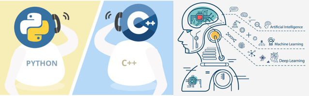

  

<h1 align="center"><strong>Hi 👋, I'm Lazar Davidovic</strong></h1>
<h2 align="center"><strong>Passionate about C++ and Python Software Engineering, AI, ML and Mathematics</strong></h2>

- I’m currently pursuing my Master’s degree in Software Engineering at the University of Belgrade
- I’m currently working as a Software Engineer at FIS Global
- My previous work experience is related to the company FIS Global and University work.
- You can reach me on **LinkedIn**: [Lazar Davidovic](https://www.linkedin.com/in/lazar-davidovi%C4%87-831887233/)

---

### Languages & Tools:

  

---

### Fun facts about me

- 🎨 I enjoy photorealistic drawing and painting.
- ♟️ I play chess and tennis
- 🍳 Cooking and mathematics teaching are my weekend relax zones

